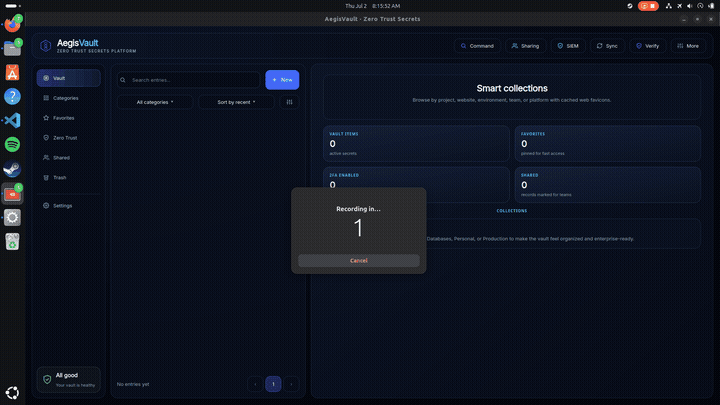

<div align="center">

# 🛡️ AegisVault

**An encrypted, local-first secrets vault — Python domain core, Rust crypto engine, desktop GUI + CLI.**

*Domain-Driven Design · Hexagonal architecture · Zero-knowledge storage*



</div>

---

## What it is

AegisVault is a `1Password`/`pass`-style secrets manager you fully own: one encrypted file (or SQLite database), no cloud, no server. A master password derives a key-encryption key that wraps a random data key (**envelope encryption**, the KMS/Vault pattern), and everything is sealed with AEAD. The GUI and CLI are thin adapters over the same application core.

**Python + Rust, each where it matters:** the domain and use cases are Python; the cryptography is a native Rust module (`ferrocrypto`: **Argon2id + XChaCha20-Poly1305 + zeroize**, via PyO3/maturin). A pure-Python backend (scrypt + AES-GCM) keeps the app fully functional without the compiled extension — same ports, swapped adapters.

## Features

**Core vault**
- Envelope encryption (random DEK wrapped by a password-derived KEK); AEAD-sealed vault file
- First-class entry model: username, URL, category, tags, notes, favorites, trash
- Password generator + entropy-based strength meter
- **TOTP/2FA**: store seeds, live 6-digit codes (RFC 6238) in GUI and CLI
- Storage backends behind one port: encrypted **file** (`vault.fv`) or **SQLite** (`vault.db`) — chosen by path

**Recovery & key management**
- **Shamir K-of-N recovery shares** (GF(2⁸) secret sharing) — reset a forgotten master password with any K of N shares; shares survive password rotation
- **Master-password rotation** (re-wraps the data key; data untouched)

**Integrity & audit**
- **Tamper-evident audit ledger**: every action in a SHA-256 hash chain; `verify` detects tampering and reports the broken block
- Merkle-root vault fingerprint
- **SIEM export**: audit chain as JSON / CEF / syslog (`audit-export`), plus live `audit-stream`

**Security posture**
- **Vault health report**: weak, reused, and 2FA-less credentials with a 0–100 score
- **HaveIBeenPwned breach check** via k-anonymity (only a 5-char SHA-1 prefix leaves the machine)
- **Credential rotation report** (`rotation-report`, `--rotation-days`)

**Team & enterprise**
- **Public-key sharing**: seal a secret to a colleague's X25519 key (ECDH + HKDF + AES-GCM sealed box); `share-list` / `share-revoke` to track and revoke
- Enterprise controls: roles, sensitivity levels, JIT access requests (`enterprise` command group)
- **Import** from Bitwarden (JSON), 1Password / KeePass / generic CSV
- Encrypted **backup / restore** and **sync bundles** (`sync-export` / `sync-import`)

**Ops & DevOps**
- **Secret injection**: `aegisvault run --prefix FV_ -- <cmd>` exposes entries as env vars to a subprocess (like `doppler run` / `vault exec`)
- **Agent**: ssh-agent-style Unix-socket daemon serving `LIST`/`GET`/`CODE`, with idle **auto-lock**

**Desktop GUI (PySide6)**
- Indigo design system (tokens + component library), bundled Inter font
- Sidebar (Vault / Categories / Favorites / Shared / Trash), search, real pagination
- Entry detail with reveal/copy and live 2FA countdown
- Dialogs: health dashboard, audit history (rendered as a linked block chain), recovery enrol/restore, rotation, command palette
- Async unlock with startup profiler (`AEGISVAULT_PROFILE_STARTUP=1`)

## Architecture

```
        CLI            GUI (PySide6)        Agent (socket)
          \                 |                  /
           └───────── inbound adapters ───────┘
                            |
              application: VaultService / VaultSession
                     (use cases, ports)
                            |
        domain: Vault · AuditLedger · Shamir · Merkle · TOTP
                 password policy/strength · health
                            |
           └───────── outbound adapters ──────┘
          /            |            |          \
   storage (file/  crypto (Rust/  breach     sharing /
   SQLite)         Python)       (HIBP)     importers / SIEM
```

Strict **hexagonal / DDD**: the domain has zero I/O; ports are `typing.Protocol`; `container.py` is the only place adapters are wired. Every feature lands as an adapter or a domain service — the GUI, CLI, and agent all drive the same core.

## Install & run

```bash
git clone https://github.com/Zoel-Manchon/aegisvault && cd aegisvault
python3 -m venv .venv && source .venv/bin/activate
pip install -e . && pip install PySide6 cryptography

# optional but recommended — build the Rust crypto core
cd rust && pip install -e . && cd ..

aegisvault --vault vault.fv init        # create a vault (or vault.db for SQLite)
aegisvault-gui --vault vault.fv         # desktop app
```

> Note: vaults are bound to the crypto backend that created them (Rust: Argon2id/XChaCha20 · Python: scrypt/AES-GCM). Build the Rust core first, then `init`.

## Workflows

```bash
# daily use
aegisvault --vault v.fv add github --username zoel --category Dev --gen-totp
aegisvault --vault v.fv get github
aegisvault --vault v.fv code github                    # live 2FA code
aegisvault --vault v.fv list

# security posture
aegisvault --vault v.fv health --check-breaches
aegisvault --vault v.fv rotation-report --rotation-days 90
aegisvault --vault v.fv verify                         # audit chain + fingerprint

# recovery
aegisvault --vault v.fv recovery-enroll -n 5 -k 3      # print 5 shares, any 3 recover
aegisvault --vault v.fv recovery-restore               # forgot password? paste shares
aegisvault --vault v.fv rotate                         # change master password

# team sharing (public-key)
aegisvault share-keygen                                # your X25519 keypair
aegisvault --vault v.fv share prod-db --to <pubkey>    # sealed blob for a colleague
aegisvault --vault v.fv receive --key ferrovault_id.key --add prod-db

# DevOps
aegisvault --vault v.fv run --prefix FV_ -- ./deploy.sh
aegisvault --vault v.fv agent --timeout 300            # auto-locking secret daemon

# data movement
aegisvault --vault v.fv import --format bitwarden --file export.json
aegisvault --vault v.fv audit-export --format cef --out audit.cef
aegisvault --vault v.fv backup --out ~/Dropbox/vault.fv
```

## Tests

```bash
pytest -q        # 96 passed — domain, application, and integration suites
```

The pure-Python crypto backend keeps CI green without a Rust toolchain; Rust-specific tests activate automatically when `ferrocrypto` is built.

## Roadmap

- GitHub Actions CI (pytest + maturin wheel build)
- Windows binary via Nuitka (GitHub Release artifact)
- Browser-extension autofill through the agent
- Passkey/WebAuthn unlock

## License

MIT
