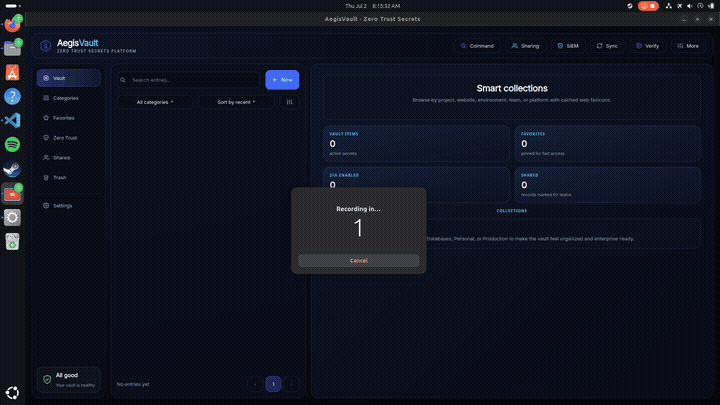
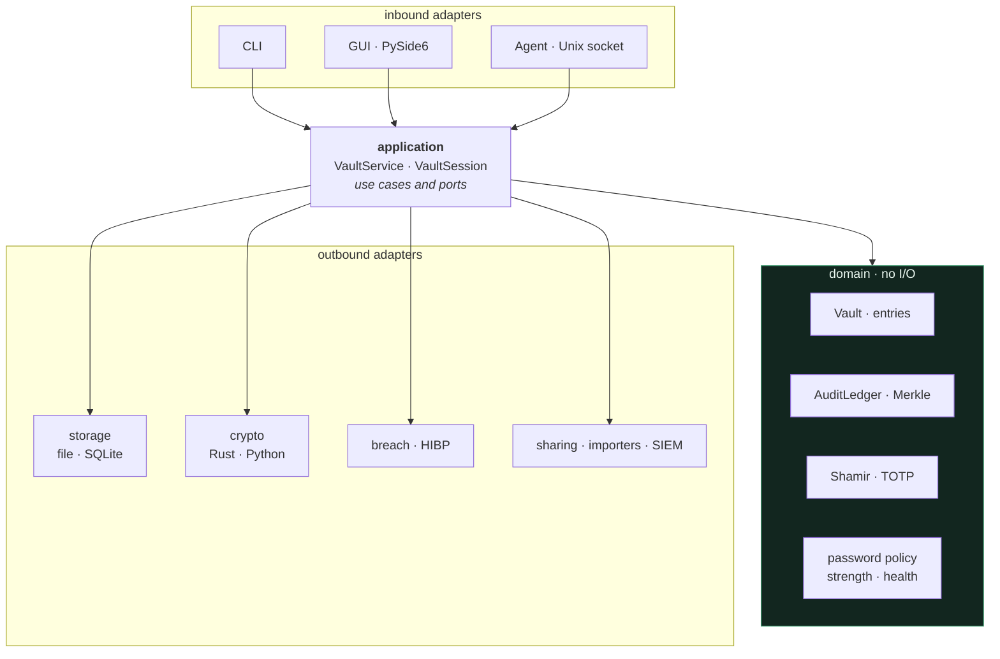
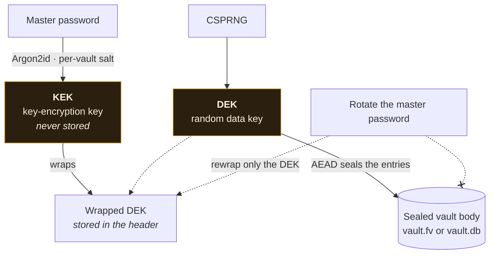
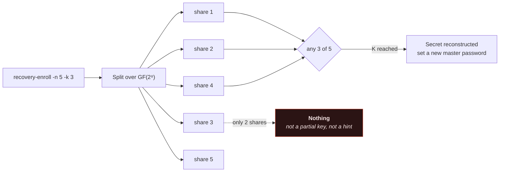
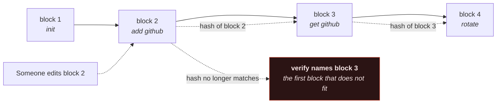

<div align="center">

# AegisVault


**An encrypted, local-first secrets vault you actually own: one file, no server,
no cloud.**



</div>

---

## At a glance

|  |  |
| --- | --- |
| **What it is** | A `1Password`/`pass`-style secrets manager where the vault is a file on your disk. GUI, CLI and a background agent are three thin adapters over one core. |
| **The one idea** | The master password never encrypts your data. It derives a key that **wraps** a random data key — envelope encryption, the pattern KMS and Vault use. Rotating the password rewraps that key; not a single secret is re-encrypted. |
| **Why two languages** | The domain is Python because that is where the rules live. The cryptography is a native Rust module — Argon2id, XChaCha20-Poly1305, `zeroize`. A pure-Python backend (scrypt + AES-GCM) keeps the app whole without a Rust toolchain: same port, different adapter. |
| **Losing the password** | Is survivable. Shamir K-of-N shares over GF(2⁸) reconstruct the key from any K of N, and the shares outlive password rotations. |
| **Tamper evidence** | Every action is a block in a SHA-256 chain. `verify` does not just say "broken" — it names the block where the chain breaks. |
| **Size** | ~98 tests · strict hexagonal, domain with zero I/O |
| **Run it** | `pip install -e .` then `aegisvault --vault vault.fv init` |

**Contents** — [Architecture](#architecture) ·
[How a vault is sealed](#how-a-vault-is-sealed) ·
[Forgetting the master password](#forgetting-the-master-password) ·
[The audit ledger](#the-audit-ledger) · [What it does](#what-it-does) ·
[Install](#install-and-run) · [Workflows](#workflows) · [Status](#status)

---

## Architecture

Strict hexagonal. The domain has zero I/O, ports are `typing.Protocol`, and
`container.py` is the only place an adapter is ever wired. The GUI, the CLI and the
agent all drive the same core — none of them can reach storage or crypto directly.


```mermaid
flowchart TB
    subgraph IN["inbound adapters"]
        CLI["CLI"]
        GUI["GUI · PySide6"]
        AG["Agent · Unix socket"]
    end

    APP["<b>application</b><br/>VaultService · VaultSession<br/><i>use cases and ports</i>"]

    subgraph DOM["domain · no I/O"]
        V["Vault · entries"]
        L["AuditLedger · Merkle"]
        S["Shamir · TOTP"]
        P["password policy<br/>strength · health"]
    end

    subgraph OUT["outbound adapters"]
        ST["storage<br/>file · SQLite"]
        CR["crypto<br/>Rust · Python"]
        BR["breach · HIBP"]
        SH["sharing · importers · SIEM"]
    end

    CLI --> APP
    GUI --> APP
    AG --> APP
    APP --> DOM
    APP --> ST
    APP --> CR
    APP --> BR
    APP --> SH

    classDef core fill:#12261f,stroke:#3f9d70,color:#e9f6ef
    class DOM core
```

Two crypto adapters sit behind one port, and the vault records which one made it:

| Backend | KDF | AEAD | When |
| --- | --- | --- | --- |
| `ferrocrypto` (Rust, PyO3/maturin) | Argon2id | XChaCha20-Poly1305 + `zeroize` | Built and importable |
| Pure Python | scrypt | AES-GCM | Fallback, keeps CI green with no toolchain |

---

## How a vault is sealed

The master password is never the key to your data. It is the key to the key.


```mermaid
flowchart TD
    PW["Master password"] -->|"Argon2id · per-vault salt"| KEK["<b>KEK</b><br/>key-encryption key<br/><i>never stored</i>"]
    RNG["CSPRNG"] --> DEK["<b>DEK</b><br/>random data key"]
    DEK -->|"AEAD seals the entries"| BODY[("Sealed vault body<br/>vault.fv or vault.db")]
    KEK -->|wraps| WRAPPED["Wrapped DEK<br/><i>stored in the header</i>"]
    DEK -.-> WRAPPED

    ROT["Rotate the master password"] -.->|"rewrap only the DEK"| WRAPPED
    ROT -.-x BODY

    classDef key fill:#2b2010,stroke:#b8860b,color:#f7f0e0
    class KEK,DEK key
```

The consequence is the point: **rotating the master password rewraps one small key.**
The entries are never decrypted, re-encrypted or rewritten, so rotation costs the same
whether the vault holds ten secrets or ten thousand — and a crash mid-rotation cannot
corrupt the body, because the body is not touched.

Storage is a port with two adapters, chosen by the path you give it: an encrypted file
(`vault.fv`) or SQLite (`vault.db`). Both hold the same sealed artifact.

---

## Forgetting the master password

A local-first vault with no recovery is one forgotten password away from total loss.
Shamir secret sharing over GF(2⁸) splits the recovery secret into N shares of which any
K reconstruct it — and **K−1 shares reveal nothing at all**, which is the property that
makes it worth doing rather than just keeping a copy of the key somewhere.


```mermaid
flowchart LR
    ENROL["recovery-enroll -n 5 -k 3"] --> SP["Split over GF(2⁸)"]
    SP --> S1["share 1"] & S2["share 2"] & S3["share 3"] & S4["share 4"] & S5["share 5"]

    S1 --> C{"any 3 of 5"}
    S2 --> C
    S4 --> C
    C -->|"K reached"| REC["Secret reconstructed<br/>set a new master password"]

    S3 -.->|"only 2 shares"| NIL["<b>Nothing</b><br/><i>not a partial key, not a hint</i>"]

    classDef bad fill:#2b1414,stroke:#d0432e,color:#f7e6e6
    class NIL bad
```

The shares survive password rotation: they recover the data key, and the data key does
not change when the password does.

---

## The audit ledger

Every action appends a block whose hash covers the previous one. Editing history means
recomputing every block after the edit — and `verify` walks the chain to find where it
stops matching.


```mermaid
flowchart LR
    B1["block 1<br/><i>init</i>"] --> B2["block 2<br/><i>add github</i>"]
    B2 --> B3["block 3<br/><i>get github</i>"]
    B3 --> B4["block 4<br/><i>rotate</i>"]
    B2 -.->|"hash of block 2"| B3
    B3 -.->|"hash of block 3"| B4

    TAMPER["Someone edits block 2"] -.-> B2
    B2 -.->|"hash no longer matches"| BREAK["<b>verify names block 3</b><br/><i>the first block that does not fit</i>"]

    classDef bad fill:#2b1414,stroke:#d0432e,color:#f7e6e6
    class BREAK bad
```

A Merkle root fingerprints the vault alongside it, and `audit-export` ships the chain to
a SIEM as JSON, CEF or syslog. `audit-stream` does the same live.

---

## What it does

**Core vault** — entry model with username, URL, category, tags, notes, favourites and
trash; password generator with an entropy-based strength meter; TOTP seeds with live
RFC 6238 codes in both GUI and CLI.

**Key management** — Shamir K-of-N recovery shares, master-password rotation.

**Integrity** — hash-chained audit ledger, Merkle-root fingerprint, SIEM export as
JSON/CEF/syslog, live stream.

**Security posture** — vault health report scoring weak, reused and 2FA-less credentials
0–100; HaveIBeenPwned breach check by k-anonymity, so only a 5-character SHA-1 prefix
ever leaves the machine; credential rotation report.

**Team** — public-key sharing that seals a secret to a colleague's X25519 key
(ECDH + HKDF + AES-GCM sealed box), with `share-list` and `share-revoke`; enterprise
roles, sensitivity levels and JIT access requests; import from Bitwarden, 1Password,
KeePass and generic CSV; encrypted backup, restore and sync bundles.

**Ops** — `aegisvault run --prefix FV_ -- <cmd>` injects entries as environment variables
into a subprocess, the way `doppler run` does; an ssh-agent-style Unix-socket daemon
serves `LIST`/`GET`/`CODE` with idle auto-lock.

**Desktop GUI** — PySide6 with an indigo design system and bundled Inter font; sidebar
across Vault, Categories, Favourites, Shared and Trash; search and real pagination;
entry detail with reveal, copy and a live 2FA countdown; dialogs for the health
dashboard, audit history rendered as a linked chain, recovery enrolment and restore,
rotation, and a command palette; async unlock with a startup profiler
(`AEGISVAULT_PROFILE_STARTUP=1`).

---

## Install and run

```bash
git clone https://github.com/Zoel-Manchon/aegisvault && cd aegisvault
python3 -m venv .venv && source .venv/bin/activate
pip install -e . && pip install PySide6 cryptography

# optional but recommended — build the Rust crypto core first
cd rust && pip install -e . && cd ..

aegisvault --vault vault.fv init        # or vault.db for the SQLite backend
aegisvault-gui --vault vault.fv
```

> A vault is bound to the crypto backend that created it — Rust means
> Argon2id/XChaCha20, pure Python means scrypt/AES-GCM. Build the Rust core **before**
> `init` if you want it.

---

## Workflows

```bash
# daily use
aegisvault --vault v.fv add github --username zoel --category Dev --gen-totp
aegisvault --vault v.fv get github
aegisvault --vault v.fv code github                    # live 2FA code
aegisvault --vault v.fv list

# security posture
aegisvault --vault v.fv health --check-breaches
aegisvault --vault v.fv rotation-report --rotation-days 90
aegisvault --vault v.fv verify                         # audit chain + fingerprint

# recovery
aegisvault --vault v.fv recovery-enroll -n 5 -k 3      # 5 shares, any 3 recover
aegisvault --vault v.fv recovery-restore               # forgot the password
aegisvault --vault v.fv rotate                         # change the master password

# team sharing, public key
aegisvault share-keygen                                # your X25519 keypair
aegisvault --vault v.fv share prod-db --to <pubkey>
aegisvault --vault v.fv receive --key ferrovault_id.key --add prod-db

# devops
aegisvault --vault v.fv run --prefix FV_ -- ./deploy.sh
aegisvault --vault v.fv agent --timeout 300            # auto-locking secret daemon

# moving data
aegisvault --vault v.fv import --format bitwarden --file export.json
aegisvault --vault v.fv audit-export --format cef --out audit.cef
aegisvault --vault v.fv backup --out ~/Dropbox/vault.fv
```

---

## Status

```bash
pytest -q      # 94 passed, 4 skipped
```

The pure-Python crypto backend keeps the suite green with no Rust toolchain; the
Rust-specific tests activate on their own once `ferrocrypto` is built. The four skips
are the tests that need it.

Still open:

- **GitHub Actions CI** — pytest against the pure-Python backend, plus a maturin wheel
  build so the Rust path is covered too.
- **Windows binary via Nuitka**, published as a release artifact.
- **Browser-extension autofill through the agent.** The agent already serves
  `LIST` / `GET` / `CODE` over its socket; what is missing is the extension and the
  native-messaging host that bridges it.
- **Passkey/WebAuthn unlock.** The seam is wired and the ceremony is not, and the code
  says so out loud: `DesktopPasskeyUnlockService` reports the platform authenticator and
  the GUI lists the enrolment steps, but `webauthn_ready` is `False` **on purpose**. A
  real unlock needs a device-bound credential store, challenge signing, account binding
  and a recovery path — and recovery shares stay mandatory before passkey-only unlock is
  ever allowed.

---

## License

MIT — see [LICENSE](LICENSE).
